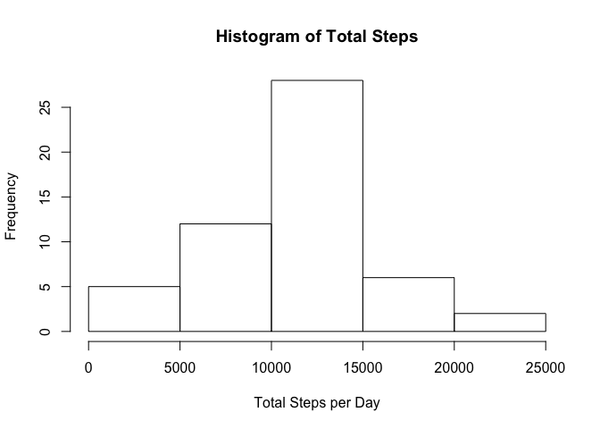

# Reproducible Research: Peer Assessment 1


## Loading and preprocessing the data

```r
activity <- read.csv("activity.csv")
```


## What is mean total number of steps taken per day?

```r
totalstep <- as.data.frame(xtabs(steps ~ date,activity))
hist(totalstep$Freq)
```

 

```r
mean(totalstep$Freq)
```

```
## [1] 9354.23
```

```r
median(totalstep$Freq)
```

```
## [1] 10395
```

## What is the average daily activity pattern?


```r
plot(activity$interval,activity$steps,type="l")
```

 

## Imputing missing values

```r
sum(is.na(activity))
```

```
## [1] 2304
```
## Are there differences in activity patterns between weekdays and weekends?

```r
activity$week <- weekdays(as.Date(activity$date))
weekdays1 <- c('Monday', 'Tuesday', 'Wednesday', 'Thursday', 'Friday')
activity$wDay <- factor(activity$week %in% weekdays1, levels = c(FALSE,TRUE), labels = c('weekend','weekday'))
```

