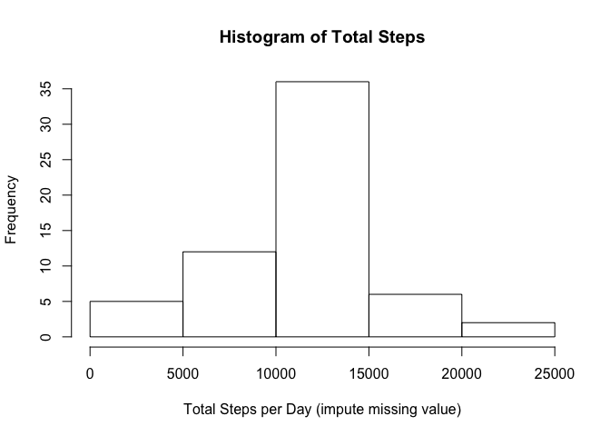

# Reproducible Research: Peer Assessment 1


## Loading and preprocessing the data


```r
activity <- read.csv("activity.csv")
```


## What is mean total number of steps taken per day?


```r
totalstep <- aggregate(steps ~ date, activity, sum)
hist(totalstep$steps,xlab = "Total Steps per Day",main = "Histogram of Total Steps")
```

 

```r
mean(totalstep$steps) 
```

```
## [1] 10766.19
```

```r
median(totalstep$steps)
```

```
## [1] 10765
```

## What is the average daily activity pattern?


```r
steps_per_interval <- aggregate(steps~interval,activity,mean)
plot(steps_per_interval,type='l')
```

 

```r
steps_per_interval$interval[which.max(steps_per_interval$steps)]
```

```
## [1] 835
```

## Imputing missing values


```r
library(Hmisc)
```

```
## Loading required package: grid
## Loading required package: lattice
## Loading required package: survival
## Loading required package: Formula
## Loading required package: ggplot2
## 
## Attaching package: 'Hmisc'
## 
## The following objects are masked from 'package:base':
## 
##     format.pval, round.POSIXt, trunc.POSIXt, units
```

```r
sum(is.na(activity))
```

```
## [1] 2304
```

```r
activity_impute <- activity
activity_impute$steps <- impute(activity$steps, fun = mean) 
totalstep_impute <- aggregate(steps ~ date, activity_impute, sum)
hist(totalstep_impute$steps,xlab = "Total Steps per Day (impute missing value)",main = "Histogram of Total Steps")
```

 

```r
mean(totalstep_impute$steps) 
```

```
## [1] 10766.19
```

```r
median(totalstep_impute$steps)
```

```
## [1] 10766.19
```
The plot looks slightly different than before imputing missing numbers.

## Are there differences in activity patterns between weekdays and weekends?


```r
activity$week <- weekdays(as.Date(activity$date))
weekdays1 <- c('Monday', 'Tuesday', 'Wednesday', 'Thursday', 'Friday')
activity$wDay <- factor(activity$week %in% weekdays1, levels = c(FALSE,TRUE), labels = c('weekend','weekday'))
dayavg_activity <- aggregate(steps ~ interval + wDay, data=activity,mean)
ggplot (dayavg_activity, aes(interval,steps)) + geom_line() + facet_grid(wDay ~.)
```

 

